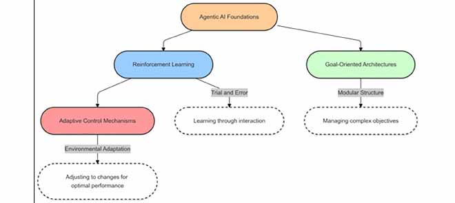
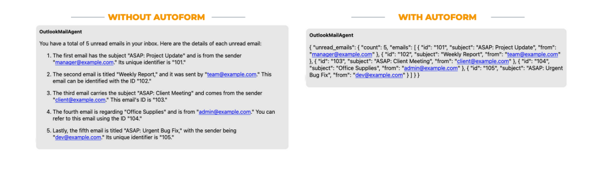
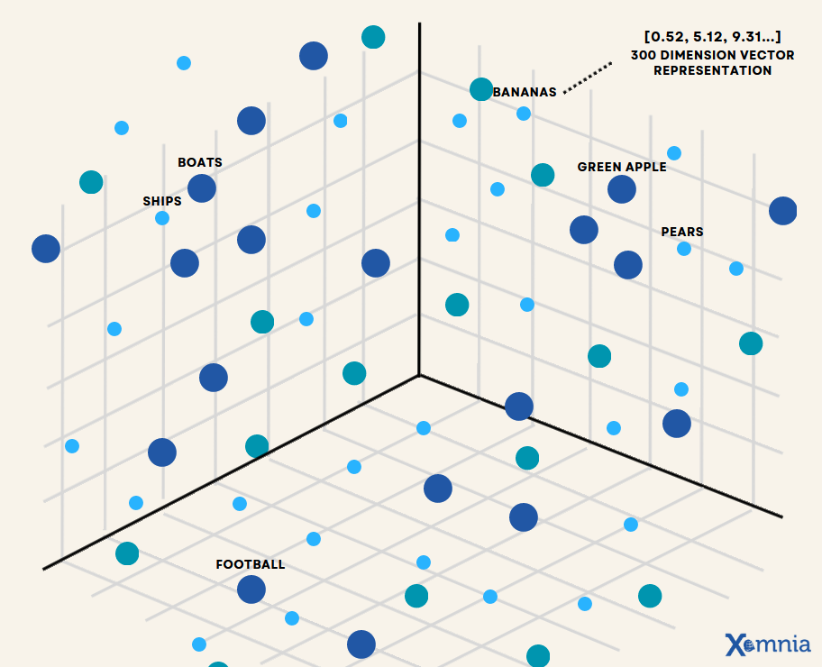
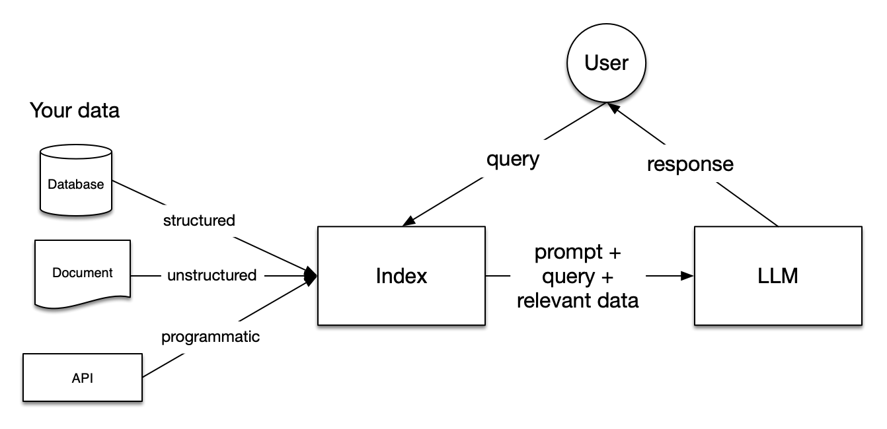

# État de l’art de l’IA agentique dans un projet d’assistant RH

> Une synthèse structurée sur les fondements, l’architecture et les bonnes pratiques de l’IA agentique et systeme MAS appliquée à un assistant RH.

***

## Sommaire

- [État de l’art de l’IA agentique dans un projet d’assistant RH](#état-de-lart-de-lia-agentique-dans-un-projet-dassistant-rh)
  - [Sommaire](#sommaire)
  - [1. Contexte et problématique](#1-contexte-et-problématique)
  - [2. Fondements de l’IA agentique](#2-fondements-de-lia-agentique)
  - [3. Architecture Multi Agent System (MAS)](#3-architecture-multi-agent-system-mas)
  - [Planification, agents et récupération d’information dans les systèmes à base de LLM](#planification-agents-et-récupération-dinformation-dans-les-systèmes-à-base-de-llm)
    - [Vue d’ensemble](#vue-densemble)
  - [Planification manuelle (Event driven)](#planification-manuelle-event-driven)
    - [Fonctionnement](#fonctionnement)
    - [Outils et bibliothèques](#outils-et-bibliothèques)
    - [Avantages et inconvénients](#avantages-et-inconvénients)
  - [LLM orchestrateur](#llm-orchestrateur)
    - [AutoForm Prompting augmentant les performances](#autoform-prompting-augmentant-les-performances)
    - [Outils et frameworks](#outils-et-frameworks)
    - [Intérêt de CrewAI](#intérêt-de-crewai)
    - [Avantages et limites](#avantages-et-limites)
  - [Planification par plans antérieurs](#planification-par-plans-antérieurs)
    - [Fonctionnement](#fonctionnement-1)
    - [Avantages et limites](#avantages-et-limites-1)
  - [Agent multi-turn et Magentic-One](#agent-multi-turn-et-magentic-one)
    - [Magentic-One](#magentic-one)
    - [Avantages et inconvénients](#avantages-et-inconvénients-1)
  - [Récupération d’information](#récupération-dinformation)
  - [Base vectorielle](#base-vectorielle)
    - [Fonctionnement](#fonctionnement-2)
    - [Avantages et inconvénients](#avantages-et-inconvénients-2)
  - [Indexation vectoriel avec LLM](#indexation-vectoriel-avec-llm)
    - [Fonctionnement](#fonctionnement-3)
  - [Indexation par graphe](#indexation-par-graphe)
    - [Fonctionnement](#fonctionnement-4)
    - [Outils et bibliothèques](#outils-et-bibliothèques-1)
  - [Retrieval](#retrieval)
  - [Classic and dense retrieval](#classic-and-dense-retrieval)
    - [Avantages et inconvénients](#avantages-et-inconvénients-3)
  - [4. MCP, outils et gestion du contexte](#4-mcp-outils-et-gestion-du-contexte)
  - [5 FRAMEWORK](#5-framework)
    - [LANGCHAIN  LANGGRAPH](#langchain--langgraph)
    - [CREWAI](#crewai)
    - [MAGENTIC ONE](#magentic-one-1)
    - [LLAMAINDEX](#llamaindex)
  - [Références](#références)

***
## 1. Contexte et problématique
L’IA agentique s’impose comme une évolution des assistants conversationnels classiques dans le domaine des ressources humaines, en réponse aux limites des chatbots actuels face aux processus complexes et contextualisés.

Aujourd’hui, un simple chatbot RH ne suffit plus pour traiter les problématiques réelles : il reste souvent cantonné à des scénarios scriptés, gère mal le contexte, et peine avec les demandes ambiguës ou spécifiques à chaque organisation. Avec la montée des approches agentiques, l’objectif devient de concevoir un véritable assistant RH capable de traiter des questions complexes propres à un organisme donné, en s’appuyant à la fois sur les documents internes, des capacités de raisonnement avancé, un contexte métier riche, l’orchestration d’outils informatiques et, lorsque c’est pertinent, des recherches sur internet.

Un tel assistant ne se contente pas de répondre en langage naturel : il coordonne plusieurs agents spécialisés pour consulter des politiques RH, interagir avec les systèmes d’information (SIRH, outils de ticketing, solutions de paie, etc.), analyser la situation de l’utilisateur et proposer des actions ou des réponses fiables. En déléguant aux agents une grande partie des tâches répétitives et des vérifications de règles, il permet aux équipes RH de se concentrer davantage sur les activités à plus forte valeur ajoutée, comme l’accompagnement, la stratégie et la qualité de l’expérience collaborateur.

## 2. Fondements de l’IA agentique

L’IA agentique désigne une classe de systèmes d’intelligence artificielle conçus pour poursuivre des objectifs complexes avec une intervention humaine minimale.elle se distingue des approches d’IA traditionnelles par son autonomie, sa capacité d’adaptation, sa prise de décision avancée et son aptitude à évoluer dans des environnements dynamiques plutôt que strictement contrôlés.

Contrairement à un modèle de langage classique, qui génère principalement une réponse à partir d’un prompt et de ses connaissances apprises, l’IA agentique s’inscrit dans une logique orientée objectifs. Elle ne se limite pas à produire du texte : elle peut analyser une situation, définir ou reformuler des sous-objectifs, planifier une séquence d’actions, mobiliser des ressources externes, puis ajuster son comportement en fonction des résultats observés. Cette différence est essentielle dans un contexte RH, où une même demande peut nécessiter plusieurs étapes de traitement, l’accès à diverses sources d’information et une adaptation au contexte de l’organisation.

Sur le plan conceptuel, l’IA agentique repose sur trois fondements techniques majeurs: l’apprentissage par renforcement, les architectures orientées objectifs et les mécanismes de contrôle adaptatif. L’apprentissage par renforcement permet à l’agent d’améliorer progressivement ses décisions à partir des retours de l’environnement. Les architectures orientées objectifs structurent la résolution de problèmes en décomposant une finalité complexe en sous-tâches plus simples. Les mécanismes de contrôle adaptatif, quant à eux, permettent d’ajuster le comportement du système lorsque le contexte évolue, lorsque les données changent ou lorsque des événements imprévus apparaissent.



L’une des caractéristiques centrales de l’IA agentique est donc sa capacité à opérer dans des environnements ouverts, incertains et évolutifs. Là où une IA classique est généralement optimisée pour une tâche bien définie dans un cadre stable, une IA agentique peut maintenir une cohérence d’action sur la durée, arbitrer entre plusieurs objectifs, tenir compte du contexte courant et revoir sa stratégie en fonction des contraintes rencontrées. Cette propriété la rend particulièrement pertinente pour les assistants RH, qui doivent souvent traiter des demandes ambiguës, multi-étapes et dépendantes de règles métier internes.

Les méthodologies récentes en IA agentique renforcent encore cette logique en intégrant des capacités de raisonnement et de planification, l’usage d’outils externes, des mécanismes de mémoire et des approches de type Retrieval-Augmented Generation (RAG).

## 3. Architecture Multi Agent System (MAS)
Un système multi-agents (MAS) se compose d’un ensemble d’agents en interaction, chacun étant responsable de sous-objectifs, de rôles ou de capacités différents. Les architectures MAS se caractérisent par une résolution distribuée des problèmes, une spécialisation des rôles et une communication inter-agents. Les agents au sein d’un MAS peuvent coopérer, se coordonner ou entrer en compétition pour atteindre des objectifs globaux du système, souvent à l’aide de mécanismes tels que la négociation, l’échange de messages ou la mémoire partagée. À l’ère des LLM, les principes des MAS sont de plus en plus adoptés dans les systèmes agentiques tels que AutoGen , CAMEL et MetaGPT , où différents agents basés sur des LLM (par exemple planificateur, exécutant, critique) collaborent via des protocoles de prompting structurés. Cette décomposition modulaire basée sur les rôles permet une meilleure scalabilité, une plus grande interprétabilité et une répartition du travail plus efficace, en particulier pour les tâches complexes et de longue durée.

## Planification, agents et récupération d’information dans les systèmes à base de LLM

### Vue d’ensemble

La planification dans les systèmes agentiques à base de LLM peut être conçue de manière explicite, sous forme de workflow prédéfini, ou de manière dynamique, où le modèle agit comme orchestrateur et ajuste ses actions selon les observations et les retours d’outils. Les travaux récents montrent que la qualité du système dépend fortement de l’articulation entre planification, mémoire, récupération d’information et contrôle de l’exécution.

Dans la pratique, les meilleures architectures combinent plusieurs paradigmes : une part déterministe pour garantir le contrôle, une part agentique pour l’adaptation, et une couche de retrieval pour ancrer les réponses dans des sources externes. Ces systèmes sont particulièrement pertinents dans les contextes industriels ou académiques où l’on recherche à la fois automatisation, traçabilité et robustesse.

---

## Planification manuelle (Event driven)

La planification manuelle correspond à une logique où les étapes du traitement sont définies à l’avance sous la forme d’un workflow, d’un graphe orienté ou d’une machine à états. Chaque transition est explicitement spécifiée : par exemple, un système peut d’abord reformuler une requête, ensuite interroger une base documentaire, puis appliquer une étape de validation avant de générer la réponse finale.

Cette approche est particulièrement adaptée aux environnements où les contraintes métier sont fortes, car elle rend l’exécution traçable, reproductible et plus facile à auditer. Elle simplifie également le débogage, puisqu’il est possible d’identifier précisément à quel nœud du graphe une erreur s’est produite. En revanche, elle devient rigide lorsque le nombre de cas particuliers augmente ou lorsque la tâche exige de l’exploration, de l’adaptation contextuelle ou de la reformulation stratégique des sous‑objectifs.

### Fonctionnement

Dans un workflow manuel, le développeur encode explicitement les nœuds de traitement et les conditions de transition. Le système ne « choisit » pas librement son prochain mouvement : il suit une topologie prédéfinie, éventuellement avec quelques embranchements conditionnels basés sur le résultat d’un outil ou sur une variable de contexte. Cette logique ressemble à une machine à états déterministe, ce qui permet d’appliquer des patterns de tolérance aux pannes, de vérification et de rollback.

### Outils et bibliothèques

Parmi les outils pertinents, LangGraph est souvent utilisé pour représenter un agent comme un graphe d’états, avec une gestion plus fine des transitions, des boucles et des points de contrôle. Dans un registre plus général, des frameworks d’orchestration de chaînes comme LangChain peuvent aussi servir de base, mais ils sont généralement moins explicites qu’un vrai modèle graphe quand la logique de contrôle devient complexe.

Des frameworks comme **CrewAI** peuvent également être utilisés pour structurer des workflows plus hiérarchiques, en décrivant des « équipes » d’agents chacun dédié à une phase spécifique du pipeline. CrewAI met l’accent sur des abstractions de haut niveau (rôles, objectifs, délégation, workflows) tout en restant compatible avec des piles comme LangChain, ce qui facilite la transition d’un prototype à un système de production.

### Avantages et inconvénients

- **Avantages** : fort contrôle sur l’exécution, bonne explicabilité, meilleure conformité aux règles métier, facilité de test unitaire et de supervision.
- **Inconvénients** : faible flexibilité, difficulté à gérer les cas imprévus, explosion de complexité lorsque le nombre de branches augmente, adaptation limitée à des tâches ouvertes.

---

## LLM orchestrateur

Dans une architecture à **LLM orchestrateur**, le modèle de langage ne se limite pas à générer du texte mais : il planifie la séquence d’actions, choisit les outils à appeler, interprète les observations et réajuste son plan au fil de l’exécution. Cette approche est devenue centrale dans les systèmes agentiques modernes, car elle permet de passer d’une simple génération de contenu à un comportement orienté objectif.

### AutoForm Prompting augmentant les performances

AutoForm désigne un mécanisme de prompting visant à améliorer la scalabilité des interactions entre agents tout en optimisant les coûts liés à l’utilisation des tokens. Il repose sur l’incitation des modèles de langage, tant au niveau des agents que de l’orchestrateur, à produire des réponses sous des formats structurés et concis, en substitution du langage naturel. Ce dernier, bien que flexible, introduit fréquemment des ambiguïtés, des redondances et des imprécisions susceptibles de dégrader la qualité et l’efficacité des échanges inter-agents. En adoptant des formats plus formels et normalisés, AutoForm permet ainsi de réduire le flou interprétatif, d’améliorer la fiabilité des communications et de limiter le volume de tokens générés en sortie. Néanmoins, cette approche implique un coût initial supplémentaire en tokens d’entrée, dû à la complexité accrue du prompt, ce qui nécessite une évaluation équilibrée entre surcharge initiale et gains en compression des réponses.

Dans le document présenté par Francesco Bacchin, cette logique est appliquée à un framework d’agents capable d’orchestrer automatiquement des workflows de traitement de données ou de génération de rapports à partir de formulaires, documents et autres sources structurées. Plutôt que de coder manuellement chaque étape, le système compose des agents spécialisés chargés de la reconnaissance, de l’extraction, de la validation et de la génération de contenu, le tout sous le contrôle d’un orchestrateur LLM central.

Le prompt est le suivant :

```To enhance clarity and eliminate ambiguities inherent in natural language, do not use natural language. Consider employing more structured and concise forms of communication for your responses. Suitable formats include structured data, JSON, XML or code. Choose the most appropriate format based on the nature of the query and the information you need to convey. Remember to be concise and accurate.```


### Outils et frameworks

Les frameworks les plus utilisés pour ce type d’architecture sont LangChain, LlamaIndex,et Magentic-One qui permettent d’encapsuler des outils, de gérer l’état et d’orchestrer les interactions entre mémoire, retrieval et appels externes. En production, ces briques sont souvent complétées par des systèmes de monitoring et de guardrails pour limiter les hallucinations et les boucles d’exécution inutiles.

### Intérêt de CrewAI

CrewAI est particulièrement adapté aux scénarios de génération de contenu, d’analyse de données, de documentation automatisée ou de suivi de tâches, où plusieurs compétences agentiques doivent être coordonnées. Son intérêt principal est de rendre explicite la répartition du travail entre agents tout en gardant une orchestration lisible et configurable.

### Avantages et limites

- **Avantages** : forte adaptabilité, meilleure gestion des tâches ouvertes, intégration facile d’outils hétérogènes, comportement plus proche d’un raisonnement pas à pas.
- **Limites** : coût d’inférence plus élevé, variance de comportement plus importante, risque de dérive de plan, besoin fort en observabilité et en contrôle.

---

## Planification par plans antérieurs

Une évolution importante consiste à réutiliser des plans antérieurs pour guider la résolution de nouvelles tâches. Cette approche repose sur l’idée qu’un agent peut capitaliser sur des trajectoires déjà observées, sous forme d’exemples, de schémas de décision abstraits ou de workflows validés, afin de réduire le coût de planification et d’améliorer la cohérence.

Dans ce type de système, les plans précédents peuvent être stockés comme traces d’exécution, graphes de décision ou workflows partiellement réutilisables. Lorsqu’une nouvelle requête arrive, l’agent recherche un plan analogue, l’adapte au nouveau contexte, puis ne replanifie que les parties qui diffèrent. Cette logique est particulièrement pertinente dans les environnements professionnels où les tâches sont récurrentes, comme le support IT, la gestion de tickets ou l’analyse documentaire spécialisée.

### Fonctionnement

Le mécanisme général repose sur trois étapes : mémorisation d’un historique de plans, recherche d’un plan proche du cas courant, puis adaptation locale de ce plan en fonction des contraintes présentes. Cette mémoire procédurale peut être stockée dans une base vectorielle, dans un graphe ou dans un système hybride, où la similarité sémantique sert à retrouver les bons exemples avant une réécriture par LLM. Dans des frameworks orchestrés comme CrewAI, ce type de mémoire peut être associé à des rôles ou à des agents récurrents.

### Avantages et limites

- **Avantages** : réduction du temps de planification, homogénéité accrue des réponses, capitalisation sur l’expérience passée.
- **Limites** : risque de suradaptation à d’anciens cas, propagation d’erreurs historiques, besoin d’une bonne indexation des traces.

---

## Agent multi-turn et Magentic-One

Un agent **multi-turn** est conçu pour fonctionner sur plusieurs cycles d’interaction plutôt que dans une seule passe de génération. À chaque tour, il interprète le nouvel état, maintient un contexte conversationnel ou opérationnel, puis adapte sa décision en conséquence. Ce type d’agent est central dans les scénarios où la tâche évolue au cours de l’échange, par exemple lors d’un diagnostic, d’une enquête documentaire, d’un assistant technique ou d’un système de résolution d’incidents.

### Magentic-One

Magentic-One, le système multi-agent de Microsoft, illustre bien cette logique à grande échelle : il compose plusieurs agents spécialisés qui se partagent le contexte, échangent des résultats intermédiaires et convergent progressivement vers une solution. L’orchestrateur planifie, suit l’avancement, puis replanifie si nécessaire pour récupérer des erreurs, tandis que les agents spécialisés exécutent des tâches comme la navigation web, la lecture de fichiers ou l’écriture et l’exécution de code.

Cette architecture met en évidence une orchestration fine des tours d’interaction, non seulement entre l’utilisateur et le système, mais aussi entre les agents eux-mêmes. Elle est adaptée aux tâches cognitives complexes, où la division du travail améliore à la fois la robustesse et la scalabilité.
### Avantages et inconvénients

- **Avantages** : simplicité conceptuelle, bonne auditabilité, intégration naturelle avec les outils externes, explicite dans les flux multi‑turn.
- **Inconvénients** : dépendance à la qualité du feedback, risque de boucles improductives, nécessité de critères d’arrêt robustes, complexité de coordination dans un système multi‑agent.
---

## Récupération d’information

La récupération d’information constitue le socle des architectures RAG et de nombreux agents outillés, car elle permet d’ancrer la génération dans des connaissances externes au modèle. Dans un système agentique, elle intervient soit comme simple étape de recherche documentaire, soit comme composant central autour duquel s’organise toute la planification.

Les approches modernes se répartissent en plusieurs grandes familles : retrieval lexical classique, retrieval dense à base d’embeddings, retrieval hybride et retrieval structuré par graphe. Chacune répond à une faiblesse particulière des autres, ce qui explique pourquoi les systèmes les plus performants les combinent plutôt que de les opposer.

---

## Base vectorielle

Une base vectorielle stocke des représentations numériques de documents, segments de texte ou autres objets informationnels sous la forme de vecteurs dans un espace de grande dimension. Lorsqu’une requête est soumise, elle est elle aussi transformée en embedding, puis comparée aux vecteurs indexés afin d’identifier les voisins les plus proches selon une mesure de similarité.



Cette technique permet de capturer la proximité sémantique au‑delà des correspondances exactes de mots, ce qui est particulièrement utile pour les reformulations, les synonymes ou les questions exprimées en langage naturel. En revanche, elle peut être moins fiable pour les noms rares, les identifiants, les expressions très spécialisées ou les cas où la précision lexicale est cruciale.

### Fonctionnement

Le pipeline typique comprend le découpage des documents en chunks, la génération d’embeddings par LLM, l’insertion dans un index ANN, puis la recherche des voisins les plus proches lors de la requête. Des structures comme HNSW sont souvent utilisées pour obtenir une bonne approximation de la recherche de plus proches voisins à grande échelle. Dans un système multi‑agent orchestré par CrewAI ou un orchestrateur LLM, la base vectorielle peut être consultée par plusieurs agents spécialisés (analyste, rédacteur, vérificateur) qui partagent ensuite le contexte identifié.


### Avantages et inconvénients

- **Avantages** : bonne capture de la similarité sémantique, efficacité sur les questions ouvertes, intégration naturelle avec les pipelines RAG et multi‑agents.
- **Inconvénients** : perte possible de précision lexicale, dépendance forte à la qualité des embeddings et du chunking, besoin fréquent de reranking ou d’hybridation.

---


## Indexation vectoriel avec LLM

L’indexation par graphe avec LLM consiste à déléguer au modèle une partie de l’extraction des entités, relations, thèmes ou communautés à partir de documents bruts. Le LLM ne sert plus uniquement à répondre aux questions ; il participe directement à la construction de la structure de recherche.

Dans les approches de type **GraphRAG**, les documents sont analysés pour produire un graphe d’entités et de relations, puis des résumés hiérarchiques sont générés pour des ensembles ou communautés de nœuds. Cette organisation permet ensuite de répondre soit localement par voisinage, soit globalement par synthèse de sous‑graphes, ce qui améliore les performances sur des questions qui exigent une compréhension structurée du corpus. L’orchestrateur LLM ou les agents multi‑turn peuvent alors naviguer dans ce graphe, en alternant consultation de voisinage, requête de résumés et PAF local.

### Fonctionnement
Le pipeline inclut généralement l’extraction guidée par LLM, la normalisation des entités, la détection de communautés, la génération de résumés structurés, puis la récupération ciblée au moment de la requête. Cette approche est puissante, mais elle dépend fortement de la qualité des prompts, des stratégies de consolidation et des étapes de validation appliquées au graphe produit. Dans un cadre multi‑agent comme CrewAI, il est possible de répartir ces rôles entre agents spécialisés (extraction, détection de communautés, validation, génération de résumés) afin de limiter les erreurs massives.


## Indexation par graphe

L’indexation par graphe représente l’information sous la forme d’entités reliées par des relations explicites, ce qui permet de raisonner non seulement sur le contenu des nœuds, mais aussi sur la structure du réseau informationnel. Cette représentation est particulièrement adaptée aux domaines où la connaissance dépend de liens multi‑hop, de dépendances sémantiques ou de structures métier complexes.

Par rapport à une base vectorielle, le graphe permet de mieux conserver la nature explicite des relations, par exemple « appartient à », « dépend de », « est causé par » ou « est situé dans ». Cette explicitation améliore la capacité à fournir des réponses justifiables et à parcourir des chaînes relationnelles longues, ce qui est difficile à obtenir avec une simple proximité vectorielle.

### Fonctionnement

Le pipeline classique comprend l’extraction d’entités, l’identification des relations, la construction des nœuds et arêtes, puis l’interrogation du graphe au moment de la recherche. Selon les systèmes, le graphe peut être parcouru par requêtes structurées, par voisinage contrôlé ou via des résumés de communautés générés à des niveaux hiérarchiques. Dans un orchestrateur LLM ou un framework multi‑agent, ces graphes peuvent être exploités pour guider la planification, par exemple en identifiant les entités critiques ou les chemins d’analyse.

### Outils et bibliothèques

Neo4j est l’une des références les plus visibles pour le stockage et l’exploration de graphes de connaissances dans ce contexte. LlamaIndex propose également des intégrations avec des graph stores, tandis que des systèmes proches de GraphRAG fournissent une méthodologie complète combinant extraction, structuration en communautés et synthèse hiérarchique. CrewAI peut intégrer ces graphes dans des workflows, par exemple en associant un agent spécialisé à la traversée du graphe et un autre à la génération de résumé.

## Retrieval

Le retrieval désigne l’ensemble des mécanismes permettant d’identifier les documents ou fragments les plus pertinents pour une requête donnée avant la génération de réponse. Dans les systèmes LLM modernes, il sert à limiter les hallucinations, à améliorer la fraîcheur informationnelle et à spécialiser les réponses sur un corpus donné.

Le cœur du problème n’est pas seulement de récupérer « quelque chose », mais de récupérer les éléments les plus utiles au bon niveau de granularité. Un retrieval de mauvaise qualité entraîne mécaniquement une génération de mauvaise qualité, même avec un modèle très performant. Dans un orchestrateur LLM ou un système multi‑agent, le retrieval est souvent partagé : plusieurs agents peuvent utiliser le même contexte extrait, ce qui améliore la cohérence des réponses entre sous‑tâches.


## Classic and dense retrieval

Le retrieval **classique**, souvent appelé **sparse retrieval**, repose sur des méthodes lexicales telles que BM25 ou TF‑IDF, qui classent les documents en fonction de la présence, de la fréquence et de la rareté des termes. Il reste extrêmement performant lorsque les requêtes contiennent des termes discriminants, des noms propres, des identifiants techniques ou des expressions exactes.

Le **dense retrieval** s’appuie au contraire sur des embeddings, ce qui lui permet de retrouver des documents proches du sens de la requête même lorsque les mots exacts diffèrent. Cette propriété le rend particulièrement adapté aux formulations naturelles, aux synonymies et aux questions exploratoires, mais moins fiable lorsque la précision terminologique est critique. Des systèmes comme **CrewAI** ou des orchestrateurs LLM peuvent combiner ces deux signaux en exposant des pipelines de recherche hybrides, où une première passe BM25 affine ensuite une passe dense, ou inversement.

Les systèmes hybrides, qui combinent recherche sparse et dense puis appliquent éventuellement un reranking, obtiennent souvent les meilleurs résultats car ils exploitent la complémentarité entre signal lexical et signal sémantique. Dans un cadre multi‑agent, il est possible de distribuer ces modes de retrieval entre agents spécialisés (par exemple un agent de consulting lexical, un agent de consulting sémantique, un agent de fusion) afin de répartir la charge de décision.


### Avantages et inconvénients

- **Avantages** : conservation explicite des relations, meilleure explicabilité, pertinence élevée sur les requêtes multi‑hop et les corpus complexes.
- **Inconvénients** : coût élevé de construction, complexité de maintenance, sensibilité aux erreurs d’extraction d’entités et de relations.

---

## 4. MCP, outils et gestion du contexte

## 5 FRAMEWORK

### LANGCHAIN  LANGGRAPH

### CREWAI

### MAGENTIC ONE

### LLAMAINDEX

## Références
-- [What Is Model Context Protocol (MCP)?](https://www.paloaltonetworks.com/cyberpedia/what-is-model-context-protocol-mcp)
- [CLAUDE SDK FOR PYTHON](https://github.com/anthropics/anthropic-sdk-python)
- [MCP PROTOCOL SDK PYTHON](https://github.com/modelcontextprotocol/python-sdk)
- [FASTMCP](https://gofastmcp.com/servers/server)
- [Performant LLM Agentic Framework for Conversational AI](https://arxiv.org/pdf/2503.06410)
- [Magentic-One: A Generalist Multi-Agent System for Solving Complex Tasks](https://www.microsoft.com/en-us/research/articles/magentic-one-a-generalist-multi-agent-system-for-solving-complex-tasks/)
- [Top 10 orchestration-Tools](https://getstream.io/blog/best-ai-orchestration-tools/)
- [The Rise of LLM-powered Agents: Reinventing Workflow Automation with Agentic AI](https://thesis.unipd.it/retrieve/af828c2b-db56-4c30-8a3b-df22fe5345ce/Bacchin_Francesco.pdf) (page 42 prompt, le reste aussi)
- [Agentic AI: Autonomous Intelligence for Complex Goals—A Comprehensive Survey](https://ieeexplore.ieee.org/abstract/document/10849561)
- [Evaluating LLM-based Agents for Multi-Turn Conversations: A Survey](https://arxiv.org/html/2503.22458v1)
- [Towards the Next Generation of Agent Systems: From RAG to Agentic AI](https://www.vldb.org/2025/Workshops/VLDB-Workshops-2025/LLM+Graph/LLMGraph-8.pdf)
- [Graph Indexing: Tree + Delta >= Graph](https://www.researchgate.net/profile/Philip-Yu-3/publication/221310199_Graph_Indexing_Tree_Delta_Graph/links/553953a80cf2239f4e7d9021/Graph-Indexing-Tree-Delta-Graph.pdf)
- [Introduction to RAG](https://developers.llamaindex.ai/python/framework/understanding/rag/)
- [Following the Autoregressive Nature of LLM Embeddings via Compression and Alignment](https://aclanthology.org/2025.emnlp-main.639.pdf)
- [AUTOREG CODE](https://github.com/TrustedLLM/AutoRegEmbed)
- [COOKBOOK CREWAI + LLAMAINDEX](https://developers.llamaindex.ai/python/examples/cookbooks/crewai_llamaindex/)

